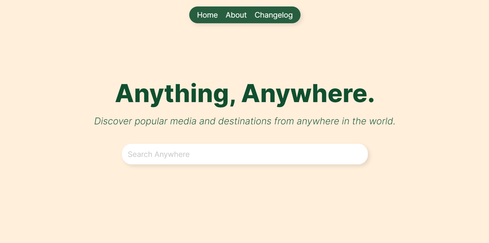

# Anything, Anywhere.

## Overview
Anything Anywhere is a web application designed to help users discover popular media and destinations from anywhere in the world. Unlike standard map applications that focus solely on places and reviews, Anything Anywhere expands the experience by including popular songs, artwork, and other forms of media.

## Current Stage
The project is currently in the development stage. Key features being worked on include:
- Integration of map functionalities for discovering places and reviews.
- Adding databases for popular songs, artwork, and other media.
- User interface design and user experience enhancements.

## Roadmap
### v0.1.0 - Initial Development
- Set up project structure and initial configurations.
- Basic map integration with location search functionality.
- Initial database setup for media content.

### v0.2.0 - Media Integration
- Added support for discovering popular songs and artwork.
- Improved user interface for media browsing.
- Enhanced search capabilities for better user experience.

### v0.3.0 - User Reviews and Ratings
- Implemented user review and rating system for places and media.
- Enhanced map functionalities with more detailed information.

Stay tuned for more updates as I continue to develop and enhance Anything Anywhere!

### Credits
- Lead Design and Programming: [Gavin Griggs](https://www.linkedin.com/in/gavin-griggs-frmthe44/)
- Co-Designer and Art Lead: [Jovan Banks](https://www.linkedin.com/in/jovan-banks-2a4498236/)